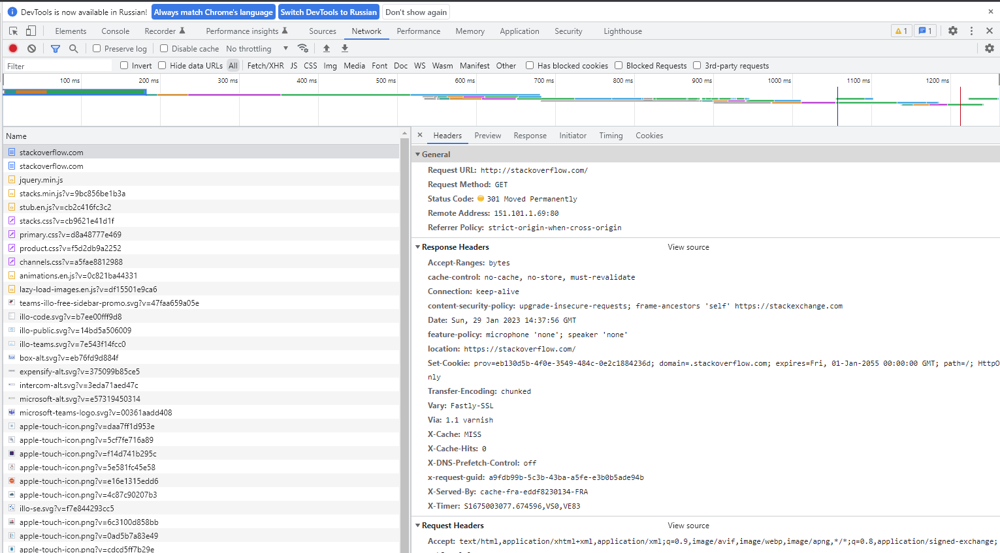
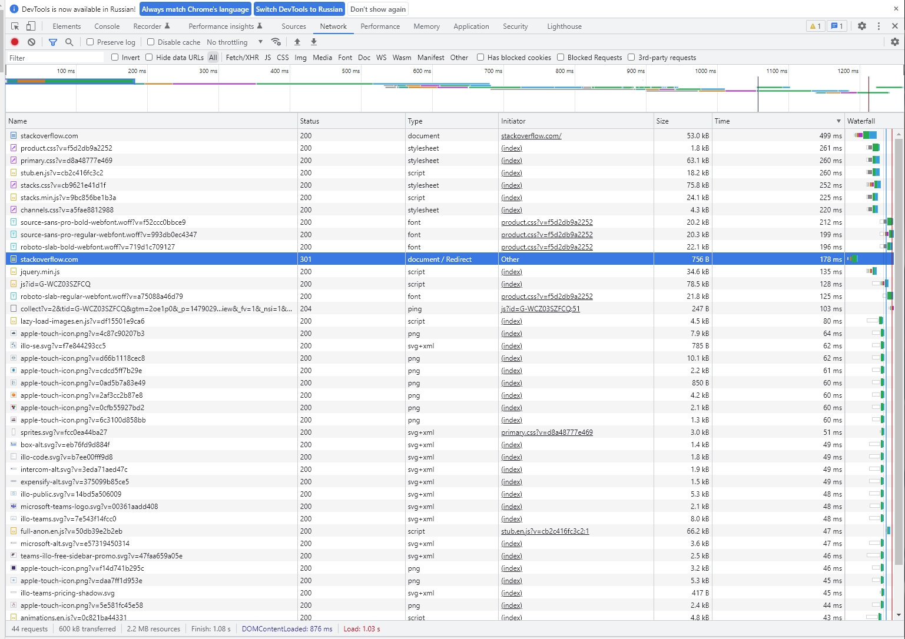

# Домашнее задание к занятию "Компьютерные сети. Лекция 1"

## 1. Работа c HTTP через телнет.

### Подключитесь утилитой телнет к сайту stackoverflow.com
     vagrant@sysadm-fs:~$ telnet stackoverflow.com 80
     Trying 151.101.193.69...
     Connected to stackoverflow.com.
     Escape character is '^]'.
     GET /questions HTTP/1.0
     HOST: stackoverflow.com
     
     HTTP/1.1 403 Forbidden
     Connection: close
     Content-Length: 1923
     Server: Varnish
     Retry-After: 0
     Content-Type: text/html
     Accept-Ranges: bytes
     Date: Sun, 29 Jan 2023 14:25:18 GMT
     Via: 1.1 varnish
     X-Served-By: cache-fra-eddf8230127-FRA
     X-Cache: MISS
     X-Cache-Hits: 0
     X-Timer: S1675002318.186130,VS0,VE1
     X-DNS-Prefetch-Control: off
     
     <!DOCTYPE html>
     <html>
     <head>
         <meta http-equiv="Content-Type" content="text/html; charset=UTF-8" />
         <title>Forbidden - Stack Exchange</title>
         
     </head>
     <body>
         

                     

                             
                     

                     

                             <h1>Access Denied</h1>
                             
This IP address (46.138.x.x) has been blocked from access to our services. If you believe this to be in       error, please contact us at <a href="mailto:team@stackexchange.com?Subject=Blocked%2046.138.x.x%20      (Request%20ID%3A%203451465785-FRA)">team@stackexchange.com</a>.

                             
When contacting us, please include the following information in the email:

                             
Method: block

                             
XID: 3451465785-FRA

                             
IP: 46.138.x.x

                             
X-Forwarded-For: 

                             
User-Agent: 

     
                             
Time: Sun, 29 Jan 2023 14:25:18 GMT

                             
URL: stackoverflow.com/questions

                             
Browser Location: (not loaded)

                     

             

             
     </body>
     </html>Connection closed by foreign host.

### В ответе укажите полученный HTTP код, что он означает?

В ответ на запрос получил код 403, он означает что мне отказано в предоставлении ответа на мой запрос по тем или иным причинам, в самой страничке ответа на 403 есть текст почему отказано - "This IP address (46.138.x.x) has been blocked from access to our services. If you believe this to be in error, please contact us"

## 2. Повторите задание 1 в браузере, используя консоль разработчика F12.

В ответ получаю 301 код, редирект на https

### проверьте время загрузки страницы, какой запрос обрабатывался дольше всего?

Дольше всего грузилась сама старница, главная

## 3. Какой IP адрес у вас в интернете?

Воспользовался внешним сервисом <https://2ip.ru/>

Мой внешний IP - 46.138.x.x

## 4. Какому провайдеру принадлежит ваш IP адрес? Какой автономной системе AS? Воспользуйтесь утилитой whois

      vagrant@sysadm-fs:~$ whois 46.138.x.x
      % This is the RIPE Database query service.
      % The objects are in RPSL format.
      %
      % The RIPE Database is subject to Terms and Conditions.
      % See http://www.ripe.net/db/support/db-terms-conditions.pdf
      
      % Note: this output has been filtered.
      %       To receive output for a database update, use the "-B" flag.
      
      % Information related to '46.138.144.0 - 46.138.159.255'
      
      % Abuse contact for '46.138.144.0 - 46.138.159.255' is 'abuse@spd-mgts.ru'
      
      inetnum:        46.138.144.0 - 46.138.159.255
      netname:        MGTS-PPPOE
      descr:          Moscow Local Telephone Network (OAO MGTS)
      country:        RU
      admin-c:        USPD-RIPE
      tech-c:         USPD-RIPE
      status:         ASSIGNED PA
      mnt-by:         MGTS-USPD-MNT
      created:        2011-12-13T10:13:45Z
      last-modified:  2011-12-13T10:13:45Z
      source:         RIPE
      
      role:           PJSC Moscow City Telephone Network NOC
      address:        USPD MGTS
      address:        Moscow, Russia
      address:        Khachaturyana 5
      admin-c:        AGS9167-RIPE
      admin-c:        AVK103-RIPE
      admin-c:        GIA45-RIPE
      tech-c:         AVK103-RIPE
      tech-c:         VMK
      tech-c:         ANO3-RIPE
      abuse-mailbox:  abuse@spd-mgts.ru
      nic-hdl:        USPD-RIPE
      mnt-by:         MGTS-USPD-MNT
      created:        2006-09-11T07:56:01Z
      last-modified:  2022-04-04T16:36:51Z
      source:         RIPE # Filtered
      
      % Information related to '46.138.0.0/16AS25513'
      
      route:          46.138.0.0/16
      descr:          Moscow Local Telephone Network (PJSC MGTS)
      descr:          Moscow, Russia
      origin:         AS25513
      mnt-by:         MGTS-USPD-MNT
      created:        2010-11-29T19:47:08Z
      last-modified:  2020-01-13T10:32:12Z
      source:         RIPE
      
      % This query was served by the RIPE Database Query Service version 1.105 (ABERDEEN)

- Провайдер - Moscow Local Telephone Network (OAO MGTS)
- Автономная система AS - AS25513

## 5. Через какие сети проходит пакет, отправленный с вашего компьютера на адрес 8.8.8.8? Через какие AS? Воспользуйтесь утилитой traceroute

      vagrant@sysadm-fs:~$ traceroute -IAn 8.8.8.8
      traceroute to 8.8.8.8 (8.8.8.8), 30 hops max, 60 byte packets
       1  10.0.2.2 [*]  0.068 ms  0.056 ms  0.051 ms
       2  192.168.1.1 [*]  1.826 ms  1.802 ms  1.795 ms
       3  100.88.0.1 [*]  6.211 ms  6.207 ms  6.364 ms
       4  212.188.1.6 [AS8359]  4.171 ms  4.362 ms  4.393 ms
       5  * 212.188.1.5 [AS8359]  4.961 ms *
       6  72.14.223.72 [AS15169]  13.322 ms  4.349 ms  4.421 ms
       7  108.170.250.34 [AS15169]  4.876 ms  6.593 ms  7.514 ms
       8  142.251.238.82 [AS15169]  25.187 ms  25.730 ms  27.063 ms
       9  142.251.238.66 [AS15169]  27.059 ms  28.536 ms  28.913 ms
      10  142.250.208.23 [AS15169]  32.408 ms  32.622 ms  32.796 ms
      11  * * *
      12  * * *
      13  * * *
      14  * * *
      15  * * *
      16  * * *
      17  * * *
      18  * * *
      19  * * *
      20  * * *
      21  * * *
      22  8.8.8.8 [AS15169/AS263411]  20.473 ms  19.929 ms  20.006 ms

Проходит через - AS8359,AS15169

## 6. Повторите задание 5 в утилите mtr. На каком участке наибольшая задержка - delay?

      vagrant@sysadm-fs:~$ mtr 8.8.8.8 -zn
      
                                                       My traceroute  [v0.93]
      sysadm-fs (10.0.2.15)                                                                          2023-01-29T15:11:51+0000
      Keys:  Help   Display mode   Restart statistics   Order of fields   quit
                                                                                     Packets               Pings
       Host                                                                        Loss%   Snt   Last   Avg  Best  Wrst StDev
       1. AS???    10.0.2.2                                                         0.0%    21    0.1   1.7   0.1  17.5   4.7
       2. AS???    192.168.1.1                                                      0.0%    21    1.6   1.1   0.8   2.8   0.4
       3. AS???    100.88.0.1                                                       0.0%    21    4.5   5.1   3.5  14.8   2.4
       4. AS8359   212.188.1.6                                                      0.0%    20    3.4   4.2   3.1   9.6   1.9
       5. AS8359   212.188.1.5                                                     80.0%    20    4.0   4.3   4.0   4.5   0.2
       6. AS15169  72.14.223.72                                                     0.0%    20    4.4   4.6   4.2   5.9   0.4
       7. AS15169  108.170.250.34                                                   0.0%    20   12.9   5.9   4.9  12.9   1.9
       8. AS15169  142.251.238.82                                                   0.0%    20   22.9  22.9  22.4  23.7   0.3
       9. AS15169  142.251.238.66                                                   0.0%    20   22.0  24.7  21.5  69.3  10.6
      10. AS15169  142.250.208.23                                                   0.0%    20   23.9  23.7  23.3  24.5   0.3
      11. (waiting for reply)
      12. (waiting for reply)
      13. (waiting for reply)
      14. (waiting for reply)
      15. (waiting for reply)
      16. (waiting for reply)
      17. (waiting for reply)
      18. (waiting for reply)
      19. (waiting for reply)
      20. (waiting for reply)
      21. (waiting for reply)
      22. AS15169  8.8.8.8                                                          0.0%    20   20.1  21.1  20.0  34.6   3.2

Наибольшая задержка на AS15169  142.251.238.66

## 7. Какие DNS сервера отвечают за доменное имя dns.google? Какие A записи? Воспользуйтесь утилитой dig

### NS

      vagrant@sysadm-fs:~$ dig NS dns.google
      
      ; <<>> DiG 9.16.1-Ubuntu <<>> NS dns.google
      ;; global options: +cmd
      ;; Got answer:
      ;; ->>HEADER<<- opcode: QUERY, status: NOERROR, id: 15103
      ;; flags: qr rd ra; QUERY: 1, ANSWER: 4, AUTHORITY: 0, ADDITIONAL: 1
      
      ;; OPT PSEUDOSECTION:
      ; EDNS: version: 0, flags:; udp: 65494
      ;; QUESTION SECTION:
      ;dns.google.                    IN      NS
      
      ;; ANSWER SECTION:
      dns.google.             7188    IN      NS      ns1.zdns.google.
      dns.google.             7188    IN      NS      ns4.zdns.google.
      dns.google.             7188    IN      NS      ns2.zdns.google.
      dns.google.             7188    IN      NS      ns3.zdns.google.
      
      ;; Query time: 0 msec
      ;; SERVER: 127.0.0.53#53(127.0.0.53)
      ;; WHEN: Sun Jan 29 15:14:12 UTC 2023
      ;; MSG SIZE  rcvd: 116

### A

      vagrant@sysadm-fs:~$ dig A dns.google
      
      ; <<>> DiG 9.16.1-Ubuntu <<>> A dns.google
      ;; global options: +cmd
      ;; Got answer:
      ;; ->>HEADER<<- opcode: QUERY, status: NOERROR, id: 44418
      ;; flags: qr rd ra; QUERY: 1, ANSWER: 2, AUTHORITY: 0, ADDITIONAL: 1
      
      ;; OPT PSEUDOSECTION:
      ; EDNS: version: 0, flags:; udp: 65494
      ;; QUESTION SECTION:
      ;dns.google.                    IN      A
      
      ;; ANSWER SECTION:
      dns.google.             552     IN      A       8.8.4.4
      dns.google.             552     IN      A       8.8.8.8
      
      ;; Query time: 0 msec
      ;; SERVER: 127.0.0.53#53(127.0.0.53)
      ;; WHEN: Sun Jan 29 15:15:09 UTC 2023
      ;; MSG SIZE  rcvd: 71

## 8. Проверьте PTR записи для IP адресов из задания 7. Какое доменное имя привязано к IP? Воспользуйтесь утилитой dig

      vagrant@sysadm-fs:~$ dig -x 8.8.8.8
      
      ; <<>> DiG 9.16.1-Ubuntu <<>> -x 8.8.8.8
      ;; global options: +cmd
      ;; Got answer:
      ;; ->>HEADER<<- opcode: QUERY, status: NOERROR, id: 39288
      ;; flags: qr rd ra; QUERY: 1, ANSWER: 1, AUTHORITY: 0, ADDITIONAL: 1
      
      ;; OPT PSEUDOSECTION:
      ; EDNS: version: 0, flags:; udp: 65494
      ;; QUESTION SECTION:
      ;8.8.8.8.in-addr.arpa.          IN      PTR
      
      ;; ANSWER SECTION:
      8.8.8.8.in-addr.arpa.   5095    IN      PTR     dns.google.
      
      ;; Query time: 0 msec
      ;; SERVER: 127.0.0.53#53(127.0.0.53)
      ;; WHEN: Sun Jan 29 15:40:02 UTC 2023
      ;; MSG SIZE  rcvd: 73
      
      vagrant@sysadm-fs:~$ dig -x 8.8.4.4
      
      ; <<>> DiG 9.16.1-Ubuntu <<>> -x 8.8.4.4
      ;; global options: +cmd
      ;; Got answer:
      ;; ->>HEADER<<- opcode: QUERY, status: NOERROR, id: 18165
      ;; flags: qr rd ra; QUERY: 1, ANSWER: 1, AUTHORITY: 0, ADDITIONAL: 1
      
      ;; OPT PSEUDOSECTION:
      ; EDNS: version: 0, flags:; udp: 65494
      ;; QUESTION SECTION:
      ;4.4.8.8.in-addr.arpa.          IN      PTR
      
      ;; ANSWER SECTION:
      4.4.8.8.in-addr.arpa.   74741   IN      PTR     dns.google.
      
      ;; Query time: 16 msec
      ;; SERVER: 127.0.0.53#53(127.0.0.53)
      ;; WHEN: Sun Jan 29 15:40:16 UTC 2023
      ;; MSG SIZE  rcvd: 73

Возвращает dns.google.